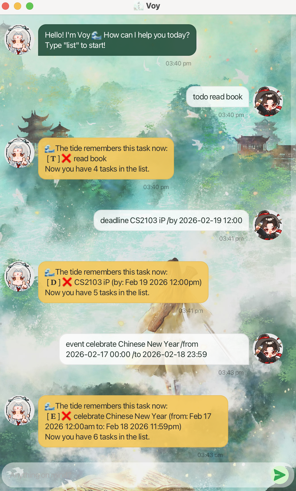

# Voy 🌊

*A calm and aesthetic task manager built with Java and JavaFX with theme of drama 赴山海.*



---

## Introduction

**Voy** is a desktop task management application that helps users manage tasks efficiently using simple command-based inputs.

Voy supports:

* ToDo tasks
* Deadlines
* Events
* Task searching
* Free time detection
* Marking/Unmarking tasks as done

It is designed for users who prefer keyboard-driven productivity with a clean graphical interface.

---
# Quick Start
1. Ensure you have **Java 17 or above** installed.
2. Download `voy.jar`.
3. Open a terminal in the folder containing the jar file.
4. Run:
```
java -jar voy.jar
```

---

# Features

---

## 1. Adding a ToDo

Adds a task without any date.

### Format

```
todo TASK_NAME
```

### Example

```
todo read book
```

### Expected Output

```
Got it. I've added this task:
[ 𝐓 ] ❌ read book
```

---

## 2. Adding a Deadline

Adds a task with a due date and time.

### Format

```
deadline TASK_NAME /by YYYY-MM-DD HH:MM
```

### Example

```
deadline return book /by 2026-06-06 23:59
```

### Expected Output

```
Got it. I've added this task:
[ 𝐃 ] ❌ return book (by: Jun 6 2026 11:59PM)
```

---

## 3. Adding an Event

Adds a task with a start and end date/time.

### Format

```
event TASK_NAME /from YYYY-MM-DD HH:MM /to YYYY-MM-DD HH:MM
```

### Example

```
event project meeting /from 2026-08-06 14:00 /to 2026-08-06 16:00
```

### Expected Output

```
Got it. I've added this task:
[ 𝐄 ] ❌ project meeting (from: Aug 6 2026 02:00PM to: Aug 6 2026 04:00PM)
```

> ⚠️ `/from` and `/to` must be provided together.

---

## 4. Listing All Tasks

Displays all tasks currently stored.

### Format

```
list
```

---

## 5. Marking a Task as Done

Marks a task as completed.

### Format

```
mark INDEX
```

### Example

```
mark 1
```

---

## 6. Unmarking a Task

Marks a completed task as not completed.

### Format

```
unmark INDEX
```

---

## 7. Finding Tasks

Searches for tasks containing a case-insensitive keyword.

### Format

```
find KEYWORD
```

### Example

```
find book
```

Displays all matching tasks.

---


## 8. Finding Free Time

Finds available time slots of a specified duration.

### Format

```
free DURATION_IN_HOURS
```

### Example

```
free 1h
```

Displays available one-hour free slots.

---

## 10. Exiting the Application

Closes Voy after displaying a farewell message.

### Format

```
bye
```

---

# Command Summary

| Command    | Description                        |
| ---------- | ---------------------------------- |
| `todo`     | Add a ToDo task                    |
| `deadline` | Add a task with due date           |
| `event`    | Add a task with start and end time |
| `list`     | List all tasks                     |
| `mark`     | Mark task as done                  |
| `unmark`   | Mark task as not done              |
| `find`     | Search tasks                       |
| `free`     | Find available time                |
| `bye`      | Exit application                   |

---
